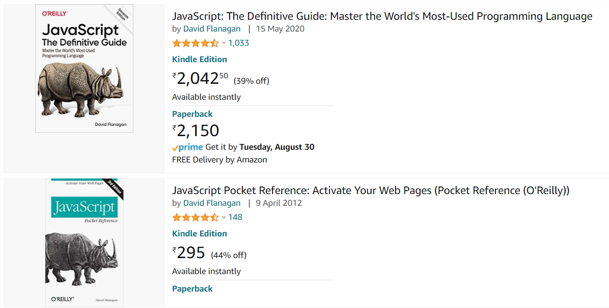

:books: **DOM Labs**  

:beginner: _**USER STORY 1**_ 

- As a user, I need a contact form for capturing the details of the interested professional.

:writing_hand: **_Requirements_**  
1. Apply different html elements
2. Use sematic tags
3. Use different types of css selectors
4. Use inline/internal/external styles.
5. [explore] Javascript for validation 

:beginner: _**USER STORY 2**_ 
- As a user, I need a theme changer with lights on and lights off.

:writing_hand: **_Requirements_**
  
  - The bulb is on with a dark background
  - The bulb is off with a light background
  - Clicking the bulb when is it on should make the bulb disapper.
  - Clicking the bulb when is it off should add another bulb.

:beginner: _**USER STORY 3**_
- As a user, I need data transfer functionality for the form below.
  

:writing_hand: **_Requirements_**
  
  - Input Details should be transferred to the table format below:
  
| Label | Value |
|-|-|
| First Name | "Rambo" |
| Last Name | "John" |

- the table shoud be on the same html form

:bulb: transfer as it is typed, or when field loses focus or on submit.

:beginner: _**US04**_  
As a user, I need to store books in my cart as below.
  

:writing_hand: **_Requirements_**
  
  - Each book be stored in a Book class
  - Store 2 or more books in booksCartArray with image
  - Render the cart dynamically on the page in a table of 2*2
  - Have a button Load Cart to perform the functionality.

:bulb: You can choose to implement with Typescript as well.